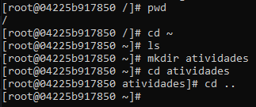
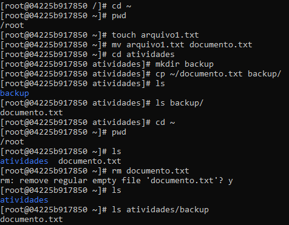
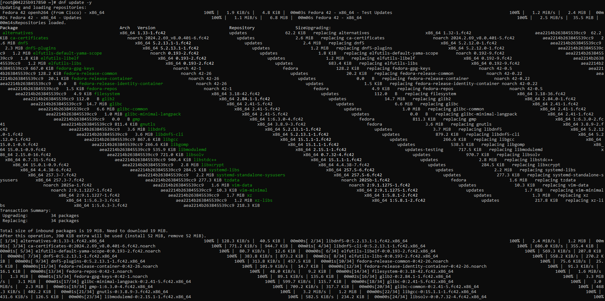
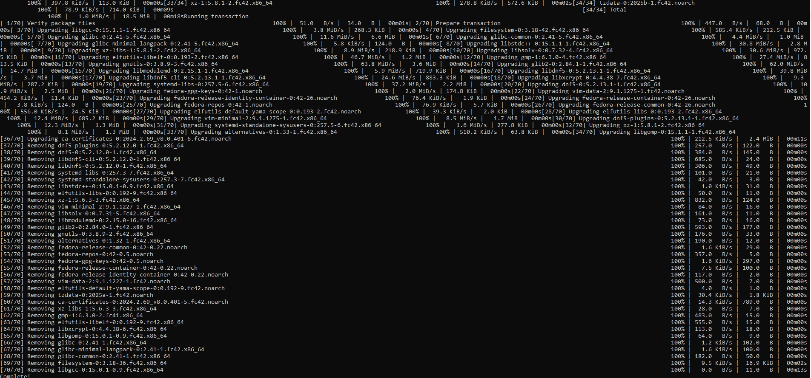
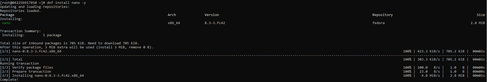
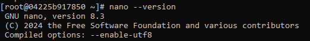
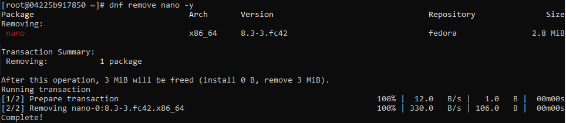
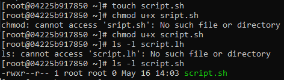
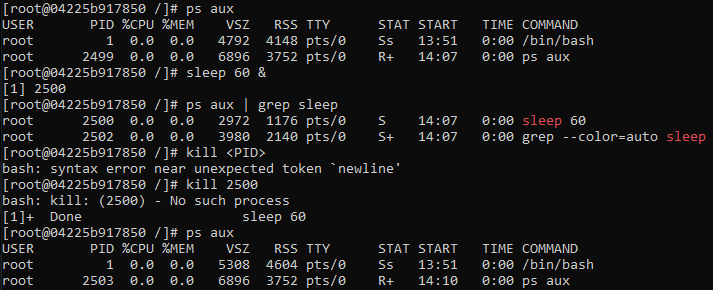

# Docker Linux Introdução - Ryan Ferreira Paulista - 09/05/2025

## Introdução
Esta atividade tem como objetivo abordar os fundamentos do Linux, incluindo sua estrutura básica, comandos essenciais e conceitos importantes para iniciantes.

## Relato

O primeiro passo foi iniciar um container Fedora e com ele já iniciado realizamos uma navegação básica.

Em seguida foi realizada uma manipulação de arquivos.

Após isso, aprendemos como instalar e desinstalar pacotes usando dnf.

Modificamos permissão de arquivos.

Monitoramos e encerramos processos.

Sendo assim finalizamos a atividade, encerramos saindo do conteiner e removendo-o.

## Conclusão

Por causa desta atividade aprendemos os conceitos básicos de linux, dessa maneira podendo prosseguir na matéria com uma base nesse sistema operacional que será muito usado. Durante a realização não tive dificuldade, pois já tinha um pequeno conhecimento sobre linux. 